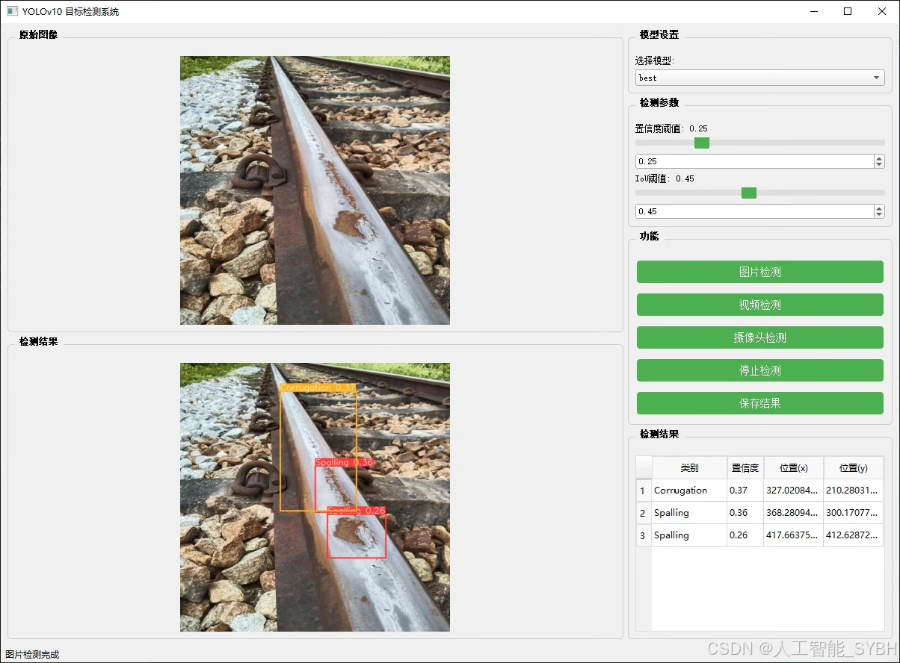
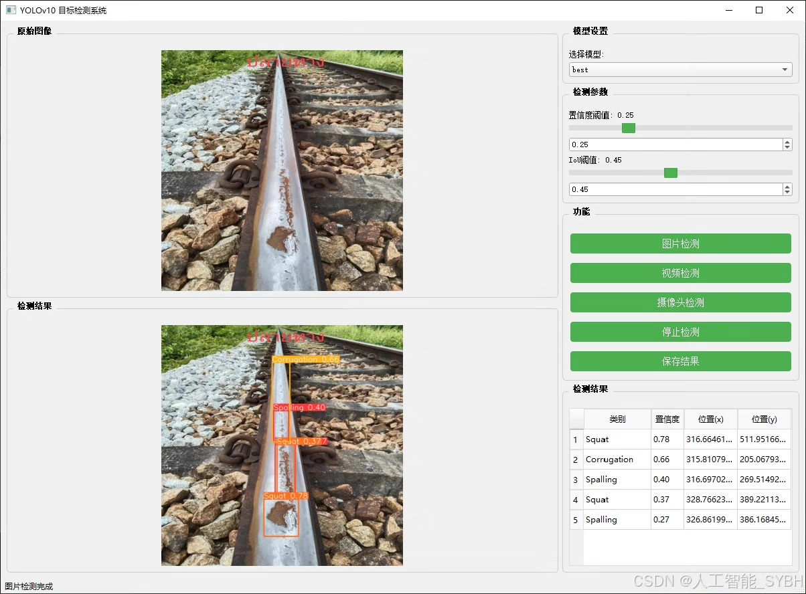
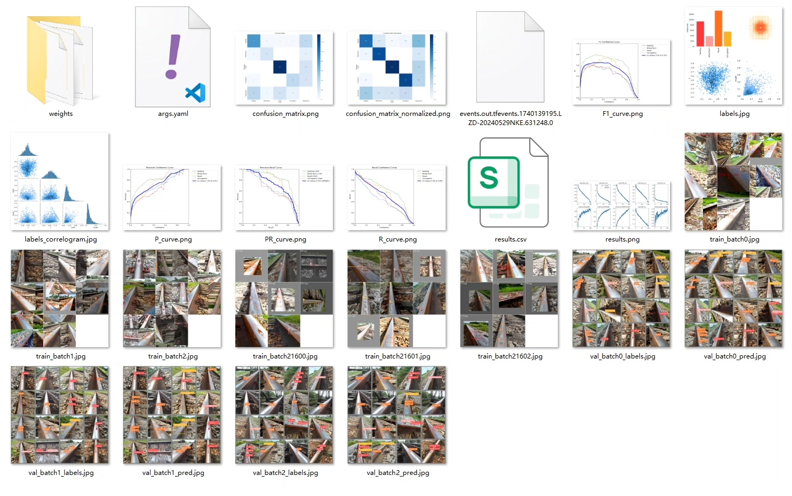
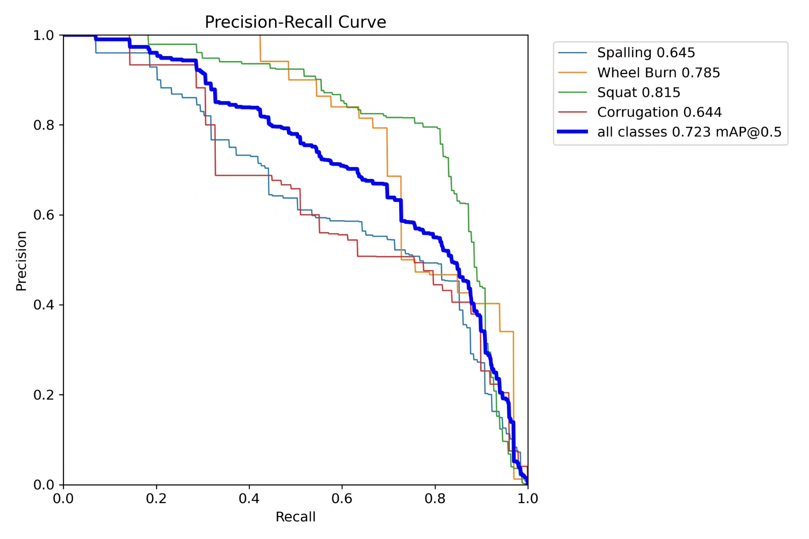
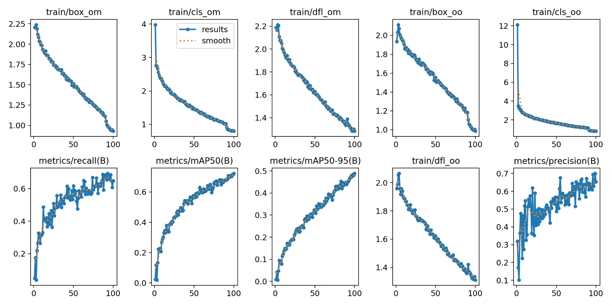
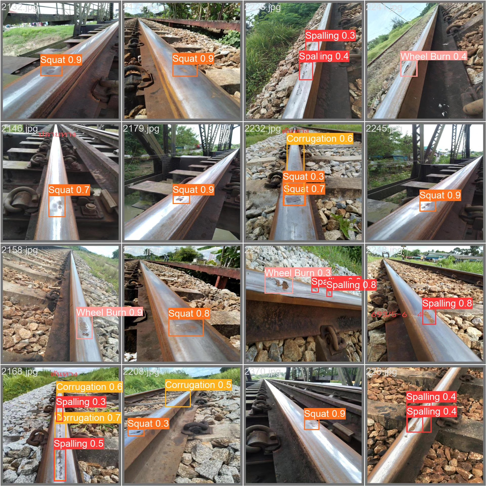
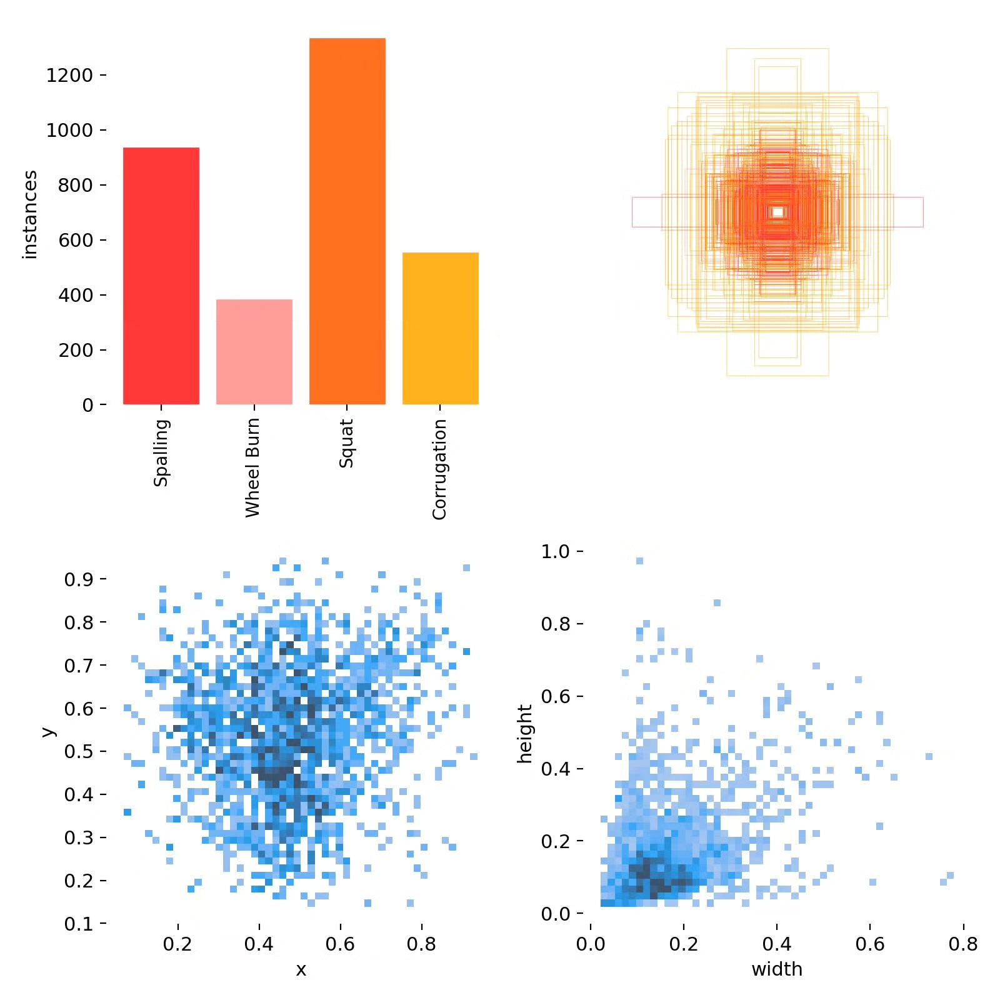
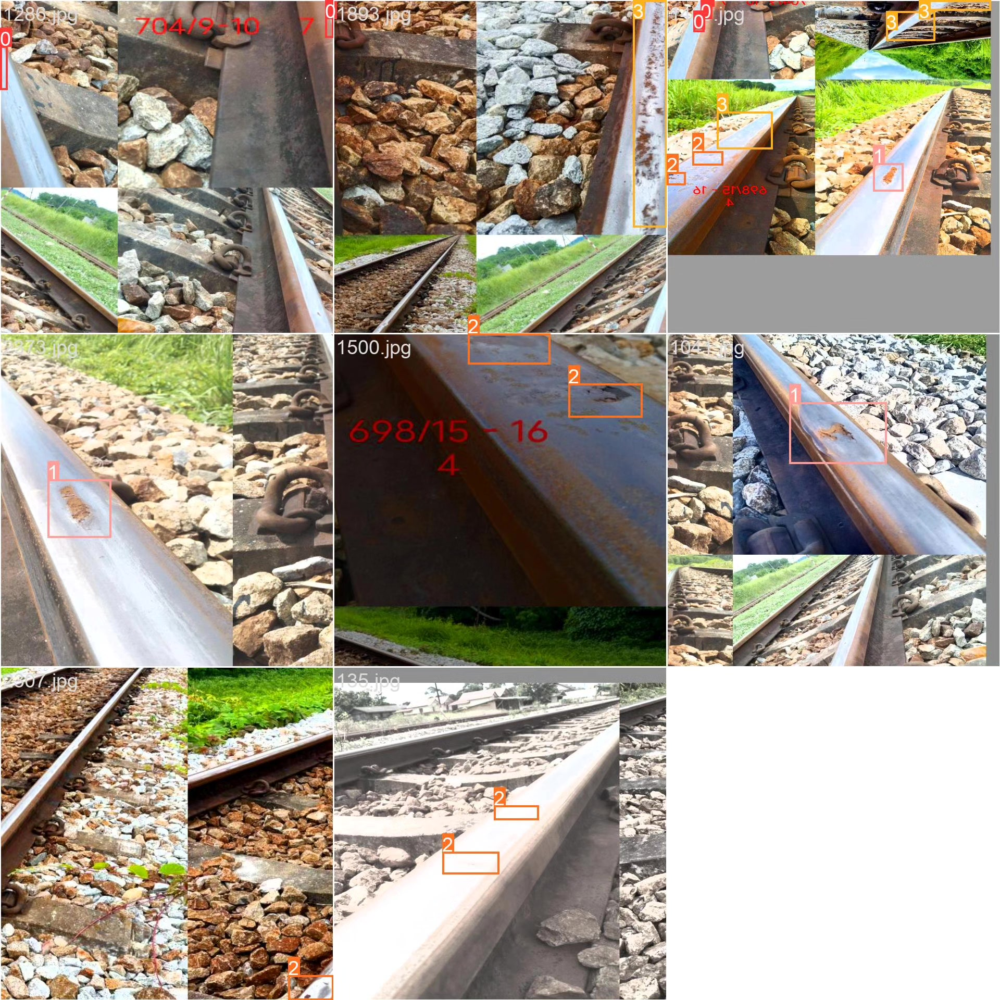

# Based on deep learning YOLOv10 for the detection of rail track defects in iron railways (YOLOv

## Body

Based on the deep learning YOLOv10, a railway track defect detection system (YOLOv10+YOLO dataset + UI interface + Python project source code + model)

The health condition of railway tracks directly affects the safety and efficiency of railway transportation. Traditional methods for track defect detection mainly rely on manual inspection or specialized detection equipment, which are inefficient and costly. With the development of computer vision and deep learning technology, image-based target detection methods have gradually become a research hotspot in track defect detection. The YOLO (You Only Look Once) series algorithms, due to their efficiency and accuracy, have been widely applied in the field of target detection. This project aims to develop a system capable of automatically detecting railway track defects based on the YOLOv10 model, helping railway departments to improve detection efficiency and safety.

Our company's products have obtained the official commercial license certification from YOLO.

We provide after-sales service.

After payment, we will provide WeChat ID for any questions, free of charge.

Environmental configuration: We will provide an instruction tutorial for environmental configuration, and WeChat will provide answers to questions.

Remote installation service: If you need remote configuration, an additional fee of 69 is required,
if the configuration fails, all fees will be refunded (for particularly old computers only the installation fee will be refunded).

Retraining dataset: After configuring the environment, you can train on your own computer.
If you need us to retrain, just pay 69 plus computing power fees (2.5 yuan/hour)

Full after-sales service

## Images

## Payment

Here is a pay link on Stripe ( https://buy.stripe.com/3cs8yP7sY87d0vu9AB ). Please contact me lonlonago@foxmail.com after funding $89, and I will send you a complete data files , thank you!

